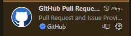
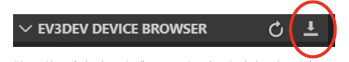

``` 
Last updated:   11/14/2022 
Authors:        Joshua Miller
```

## Useful items
* [Wumpus Project](https://homepages.hass.rpi.edu/heuveb/Teaching/M&M/WumpusWorld/WumpusWorld.htm)
* [Learn EV3 Python](https://sites.google.com/site/ev3devpython/learn_ev3_python)
* [EV3 Dev](https://www.ev3dev.org/)
* [Python Example](https://github.com/ev3dev/ev3dev-lang-python)
* [API Reference](https://ev3dev-lang.readthedocs.io/projects/python-ev3dev/en/ev3dev-stretch/spec.html)


## How to proceed:
1. [How to start](#how-to-start)
2. [How to code](#how-to-code)

## How to start:
1. Download Visual Studio Code - Software for building code for the robot (IDE): [https://code.visualstudio.com/](https://code.visualstudio.com/)
2. Install Python - Programming Language used for the robot: [https://www.python.org/](https://www.python.org/)
3. Install Git - How we will share our code: [https://git-scm.com/downloads](https://git-scm.com/downloads)
4. Open Visual Studio Code
5. On the left pane, select Extensions: 
6. Install the plugins: Make sure the author is correct!
    * ev3dev-browser: Allows us to communicate to the robot
      * Author:     ev3dev
      * Version:    > 1.0.4
      * Image:      
    * GitHub Pull Requests and Issues: Allows for the access to the code
      * Author:     GitHub
      * Image:      
7. Open a Terminal: One is included in Visual Studio Code
8. Enter the following command: ```pip install python-ev3dev```
   * Installs the ev3dev libraries so you can get better syntax highlighting. (And remove the library not found error)
9. Connect to the robot: [Connecting to the robot](#connecting-to-the-robot)
10. Setup GitHub - So you can get the code, and contribute to it: [Setup Github](#setup-github)
11. Connect the robot to Visual Studio Code: [Connect your EV3 to Visual Studio Code](#connect-your-ev3-to-visual-studio-code)


## How to Code:
1. Make sure you did everything in [How to start](#how-to-start)
2. Do some coding.
3. Save the code. (`ctrl+s`)
4. [Upload to GitHub](#upload-to-github)


## Connecting to the robot
1. Have the robot charged
2. Turn on the robot: Press the square button in the middle of the boi
3. Wait for the robot to startup
4. Navigate to the menu *Wireless and Networks > Bluetooth*
5. If not already, turn on:
   1. *Powered*
   2. *Visible*
6. Press the *Start Scan* button
7. On your PC (or mac? :/) open bluetooth devices settings.
8. Click the button designating adding a bluetooth device
9. Either click on the robot's name from your PC, or your computer's name from the robot.
10. Make sure the pins matchup, and accept the pair request.


## Setup Github
1. Cry
2. Brace yourself
3. Cry again
4. Make a folder for your project on your computer
5. Open a Terminal: One is included in Visual Studio Code
6. Change directory to that of the folder you just created: ```cd <folder>``` will help. Either enter the absolute path, or the name of a folder inside the folder you currently are in. - Crying yet?
7. Run the command: ```git init``` - will tell git/(GitHub, kind of, it is a square and rectangle relationship) that this folder will be communicating with git/GitHub. 
8. Pull the code: [Pulling code from Github](#pulling-code-from-github)
9. Code.


## Pulling code from Github:
1. Run the command: ```git pull <repository> <branch>``` - this will get the code from our project, and store it onto your computer:
    * Our ```<repository>```: (https://github.com/CodingPupper3033/M-M.git)[https://github.com/CodingPupper3033/M-M.git]
    * The branch is up for you to decide. Leaving it blank will take you to master (where the most "final" code should go)


## Connect your EV3 to Visual Studio Code
1. Click on the Explorer button on the left pane: 
2. At the bottom, expand the tab *EV3DEV DEVICE BROWSER*: 
3. Click *Click here to connect to a device*
4. Click the correct device in the list of devices that pops up in the center of your screen.
5. Should be all set.

## Uploading code to the EV3
1. Click the download button in the EV3DEV DEVICE BROWSER Tab: 

## Running your code.
1. If not already, upload your code: [Uploading code to the EV3](#uploading-code-to-the-ev3)
2. There are different options:
   * On the Brick:
     * **A.)** Browse to the file, and click on the file
   * On your computer (first open the EV3DEV device browser)
     * **B.)** Right click the file, and hit run.
     * **C.)** Left click the file, and then hit run in the popup.
     * **D.)** Right click the robot name. Click open SSH Terminal. ```cd``` to the correct directory. Run the file by entering the command ```brickrun -r ./filename```
       * This option allows for communication between the robot and your computer. Useful for robot signals.


# Upload to GitHub
* There are different options:
  * **A.)** Terminal
    1. Open a Terminal: One is included in Visual Studio Code
    2. Navigate to the main folder if not already
    3. Run `git add .` - Adds all the files that are changed to the staging area (getting it prepared to be shipped off). Other option is to do `git add <file name>` for each modified file.
    4. Run `git commit -m "<message>"` - Adds this set of changes to the repository (repository is like the storage of this project on GitHub) with a meggage: Make the message a short desscription of what changes were made.
    5. Run `git push` - This ships all your commits off to the repository so others can see your commits
  * **B.)**
    1. Click Source Control: [Source Control Button](readme-assets/source-control-button.png)
    2. Enter a message - Make the message a short desscription of what changes were made.
    3. Click Commit. (Save all if you haven't already)
    4. Click *Yes* to staging (you can also select *Always* if you want).
    5. Click Sync Changes.
    6. Click OK to the message.